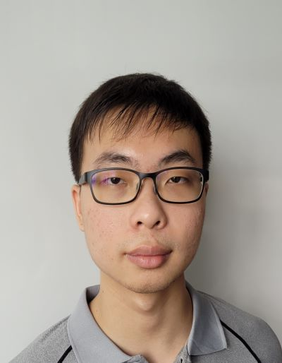
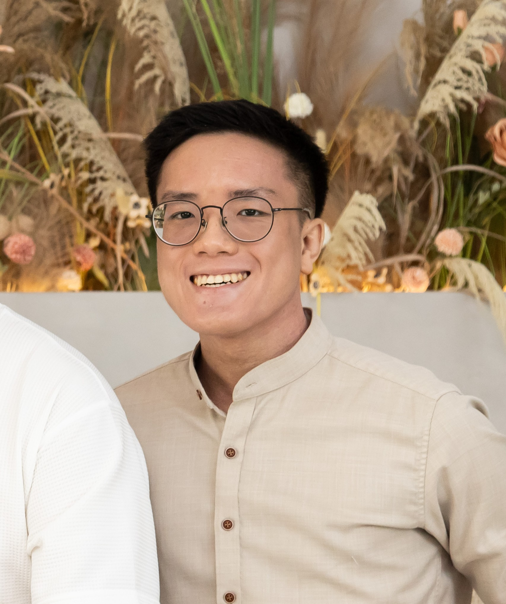
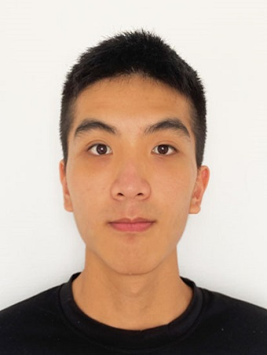

We are a team based in the [School of Computing, National University of Singapore](https://www.comp.nus.edu.sg).

You can reach us at the email `seer[at]comp.nus.edu.sg`

## Project team

### Lee Poh Hien

[[homepage](http://www.comp.nus.edu.sg/~damithch)]
[[github](https://github.com/Ruinim)]
[[portfolio](team/ruinim.md)]

* Role: Project Advisor

### Sean Ng Hao Jun

[[github](http://github.com/lunardrak)]
[[portfolio](team/lunardrak.md)]

* Role: Team Lead
* Responsibilities: UI

### Timothy Quek

[[github](http://github.com/WhyisQuek)]
[[portfolio](team/whyisquek.md)]

* Role: Developer
* Responsibilities: Data

### Yeo Beng Jun Vincent

[[github](http://github.com/goatmilkkk)]
[[portfolio](team/johndoe.md)]

* Role: Developer
* Responsibilities: App Logic

### Yue Jun Wei

[[github](http://github.com/jxnwxx)]
[[portfolio](team/jxnwxx.md)]

* Role: Developer
* Responsibilities: UI
