* Table of Contents
{:toc}
1. [Acknowledgements](#acknowledgements)
2. [Setting up, getting started](#setting-up-getting-started)
3. [Design](#design)
   1. [Architecture](#architecture)
   2. [UI component](#ui-component)
   3. [Logic component](#logic-component)
   4. [Model component](#model-component)
   5. [Storage component](#storage-component)
   6. [Common classes](#common-classes)
   7. [Implementation](#implementation)
4. [Documentation, logging, testing, configuration, dev-ops](#documentation-logging-testing-configuration-dev-ops)
5. [Appendix: Requirements](#appendix-requirements)
6. [Appendix: Instructions for manual testing](#appendix-instructions-for-manual-testing)

--------------------------------------------------------------------------------------------------------------------

## **Acknowledgements**

* {list here sources of all reused/adapted ideas, code, documentation, and third-party libraries -- include links to the original source as well}

--------------------------------------------------------------------------------------------------------------------

## **Setting up, getting started**

Refer to the guide [_Setting up and getting started_](SettingUp.md).

--------------------------------------------------------------------------------------------------------------------

## **Design**

:bulb: **Tip:** The `.puml` files used to create diagrams are in this document `docs/diagrams` folder. Refer to the [_PlantUML Tutorial_ at se-edu/guides](https://se-education.org/guides/tutorials/plantUml.html) to learn how to create and edit diagrams.

### Architecture

The ***Architecture Diagram*** given above explains the high-level design of the App.

Given below is a quick overview of main components and how they interact with each other.

**Main components of the architecture**

**`Main`** (consisting of classes [`Main`](https://github.com/AY2526S1-CS2103T-W10-3/tp/tree/master/src/main/java/seedu/address/Main.java) and [`MainApp`](https://github.com/AY2526S1-CS2103T-W10-3/tp/tree/master/src/main/java/seedu/address/MainApp.java)) is in charge of the app launch and shut down.
* At app launch, it initializes the other components in the correct sequence, and connects them up with each other.
* At shut down, it shuts down the other components and invokes cleanup methods where necessary.

The bulk of the app's work is done by the following four components:

* [**`UI`**](#ui-component): The UI of the App.
* [**`Logic`**](#logic-component): The command executor.
* [**`Model`**](#model-component): Holds the data of the App in memory.
* [**`Storage`**](#storage-component): Reads data from, and writes data to, the hard disk.

[**`Commons`**](#common-classes) represents a collection of classes used by multiple other components.

**How the architecture components interact with each other**

The *Sequence Diagram* below shows how the components interact with each other for the scenario where the user issues the command `delete 1`.

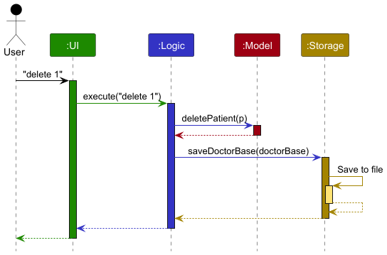

Each of the four main components (also shown in the diagram above),

* defines its *API* in an `interface` with the same name as the Component.
* implements its functionality using a concrete `{Component Name}Manager` class (which follows the corresponding API `interface` mentioned in the previous point.

For example, the `Logic` component defines its API in the `Logic.java` interface and implements its functionality using the `LogicManager.java` class which follows the `Logic` interface. Other components interact with a given component through its interface rather than the concrete class (reason: to prevent outside component's being coupled to the implementation of a component), as illustrated in the (partial) class diagram below.

The sections below give more details of each component.

### UI component

The **API** of this component is specified in [`Ui.java`](https://github.com/AY2526S1-CS2103T-W10-3/tp/tree/master/src/main/java/seedu/address/ui/Ui.java)

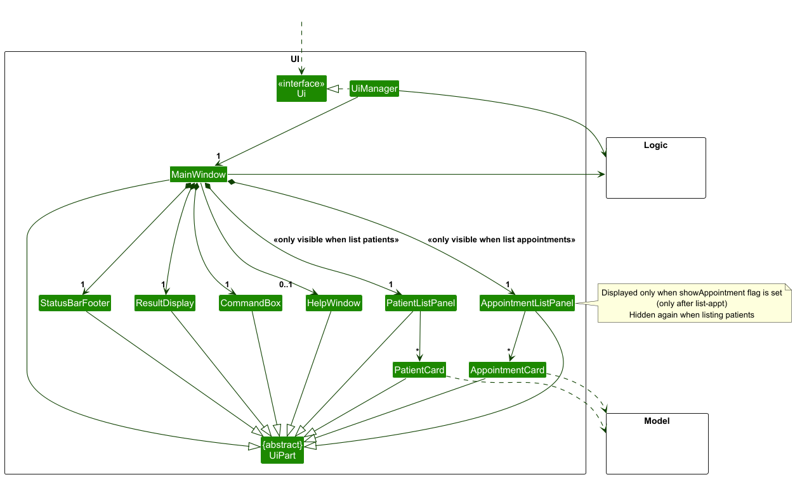

The UI consists of a `MainWindow` that is made up of parts e.g.`CommandBox`, `ResultDisplay`, `PatientListPanel`, `StatusBarFooter` etc. All these, including the `MainWindow`, inherit from the abstract `UiPart` class which captures the commonalities between classes that represent parts of the visible GUI.

The `UI` component uses the JavaFx UI framework. The layout of these UI parts are defined in matching `.fxml` files that are in the `src/main/resources/view` folder. For example, the layout of the [`MainWindow`](https://github.com/AY2526S1-CS2103T-W10-3/tp/tree/master/src/main/java/seedu/address/ui/MainWindow.java) is specified in [`MainWindow.fxml`](https://github.com/AY2526S1-CS2103T-W10-3/tp/tree/master/src/main/resources/view/MainWindow.fxml)

The `UI` component,

* executes user commands using the `Logic` component.
* listens for changes to `Model` data so that the UI can be updated with the modified data.
* keeps a reference to the `Logic` component, because the `UI` relies on the `Logic` to execute commands.
* depends on some classes in the `Model` component, as it displays `Patient` and `Appointment` objects residing in the 
`Model`.

`MainWindow` also handles switching between views:
* `PatientListPanel` is shown when the user is browsing patients
* `AppointmentListPanel` is shown when the user requests to view appointments

Additionally, the `HelpWindow` is displayed when the user issues the `help` command or presses **F1**. 

The `StatusBarFooter` at the bottom of the UI updates according to what the user is currently viewing
(either overall patient data or a specific patient’s appointment list).

### Logic component

**API** : [`Logic.java`](https://github.com/AY2526S1-CS2103T-W10-3/tp/tree/master/src/main/java/seedu/address/logic/Logic.java)

Here's a (partial) class diagram of the `Logic` component:

The sequence diagram below illustrates the interactions within the `Logic` component, taking `execute("delete 1")` API call as an example.

:information_source: **Note:** The lifeline for `DeleteCommandParser` should end at the destroy marker (X) but due to a limitation of PlantUML, the lifeline continues till the end of diagram.

How the `Logic` component works:

1. When `Logic` is called upon to execute a command, it is passed to an `DoctorBaseParser` object which in turn creates a parser that matches the command (e.g., `DeleteCommandParser`) and uses it to parse the command.
2. This results in a `Command` object (more precisely, an object of one of its subclasses e.g., `DeleteCommand`) which is executed by the `LogicManager`.
3. The command can communicate with the `Model` when it is executed (e.g. to delete a patient).  
   Note that although this is shown as a single step in the diagram above (for simplicity), in the code it can take several interactions (between the command object and the `Model`) to achieve.
4. The result of the command execution is encapsulated as a `CommandResult` object which is returned back from `Logic`.

Here are the other classes in `Logic` (omitted from the class diagram above) that are used for parsing a user command:

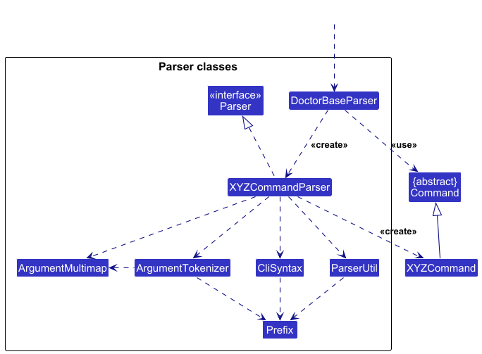

How the parsing works:
* When called upon to parse a user command, the `DoctorBaseParser` class creates an `XYZCommandParser` (`XYZ` is a placeholder for the specific command name e.g., `AddCommandParser`) which uses the other classes shown above to parse the user command and create a `XYZCommand` object (e.g., `AddCommand`) which the `DoctorBaseParser` returns back as a `Command` object.
* All `XYZCommandParser` classes (e.g., `AddCommandParser`, `DeleteCommandParser`, ...) inherit from the `Parser` interface so that they can be treated similarly where possible e.g, during testing.

### Model component
**API** : [`Model.java`](https://github.com/AY2526S1-CS2103T-W10-3/tp/tree/master/src/main/java/seedu/address/model/Model.java)

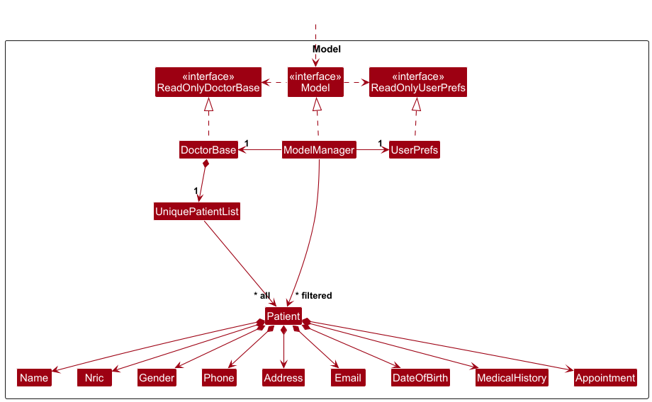

The `Model` component,

* stores the DoctorBase data i.e., all `Patient` objects (which are contained in a `UniquePatientList` object).
* stores the currently 'selected' `Patient` objects (e.g., results of a search query) as a separate _filtered_ list which is exposed to outsiders as an unmodifiable `ObservableList<Patient>` that can be 'observed' e.g. the UI can be bound to this list so that the UI automatically updates when the data in the list change.
* stores a `UserPref` object that represents the user’s preferences. This is exposed to the outside as a `ReadOnlyUserPref` objects.
* does not depend on any of the other three components (as the `Model` represents data entities of the domain, they should make sense on their own without depending on other components)

:information_source: **Note:** An alternative (arguably, a more OOP) model is given below. It has a `MedicalHistory` list in `DoctorBase`, which `Patient` references. This allows `DoctorBase` to only require one `MedicalHistory` object per unique medical history, instead of each `Patient` needing their own `MedicalHistory` objects.  

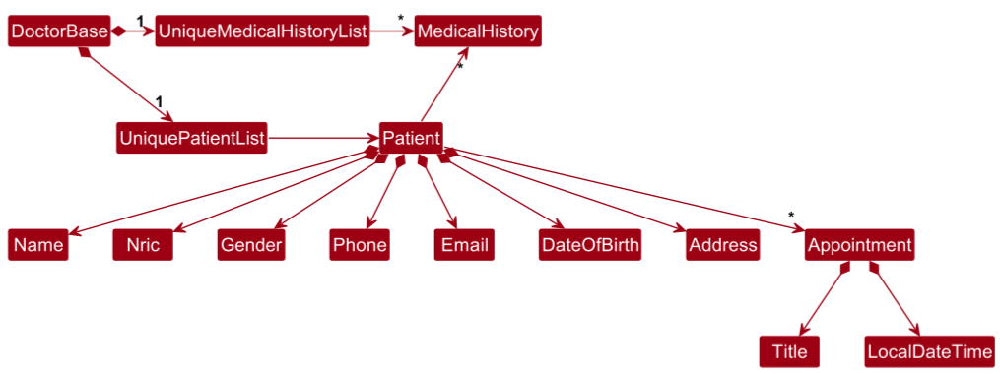

### Storage component

**API** : [`Storage.java`](https://github.com/AY2526S1-CS2103T-W10-3/tp/tree/master/src/main/java/seedu/address/storage/Storage.java)

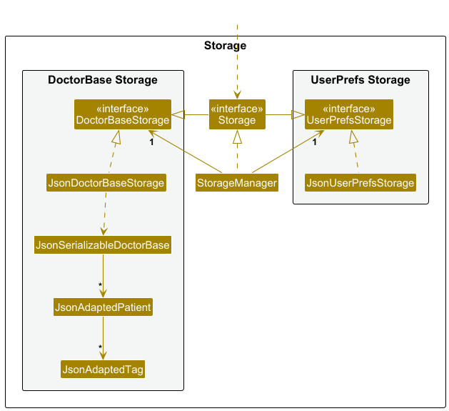

The `Storage` component,
* can save both DoctorBase data and user preference data in JSON format, and read them back into corresponding objects.
* inherits from both `DoctorBaseStorage` and `UserPrefStorage`, which means it can be treated as either one (if only the functionality of only one is needed).
* depends on some classes in the `Model` component (because the `Storage` component's job is to save/retrieve objects that belong to the `Model`)

### Common classes

Classes used by multiple components are in the `seedu.address.commons` package.

--------------------------------------------------------------------------------------------------------------------

## **Implementation**

This section describes some noteworthy details on how certain features are implemented.

## Some features
For parsing the commands entered by the user, some examples are the AddAppointmentCommandParser and DeleteAppointmentCommandParser.  
They are used to extract the appointment information provided, along with the index of the patient to operate on.

### Adding appointment feature

The following activity diagram summarizes what happens when the `AddAppointmentParser` attempts to parse the user's input:
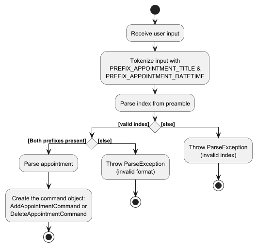

The following activity diagram summarizes what happens when a user executes the `AddAppointmentCommand`:
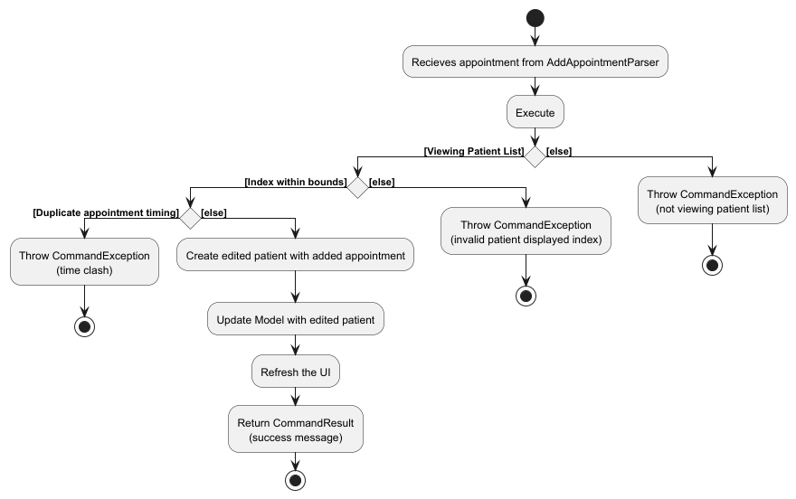

The following sequence diagram shows how an add-appt command interacts within the Logic component.
Using `add-appt 1 at/DentalCheckup ad/10-10-2010, 0900` as an example.
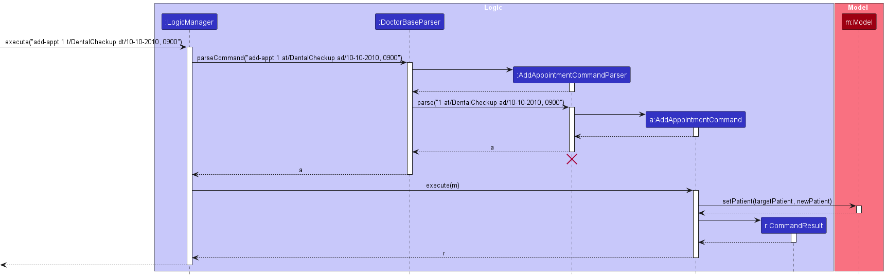

### Deleting appointment feature
The following activity diagram summarizes what happens when the `DeleteAppointmentParser` attempts to parse the user's input:
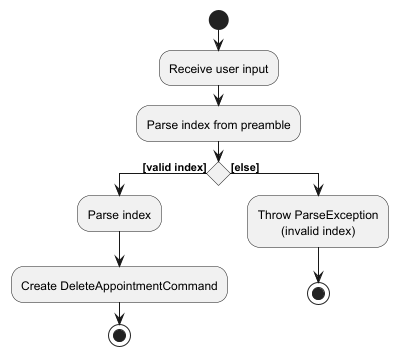

The following activity diagram summarizes what happens when a user executes the `DeleteAppointmentCommand`:
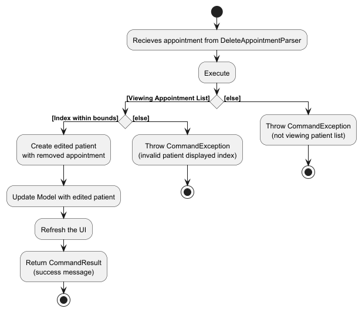

The following sequence diagram shows how a delete-appt command interacts within the Logic component.
Using `delete-appt 1` as an example. 
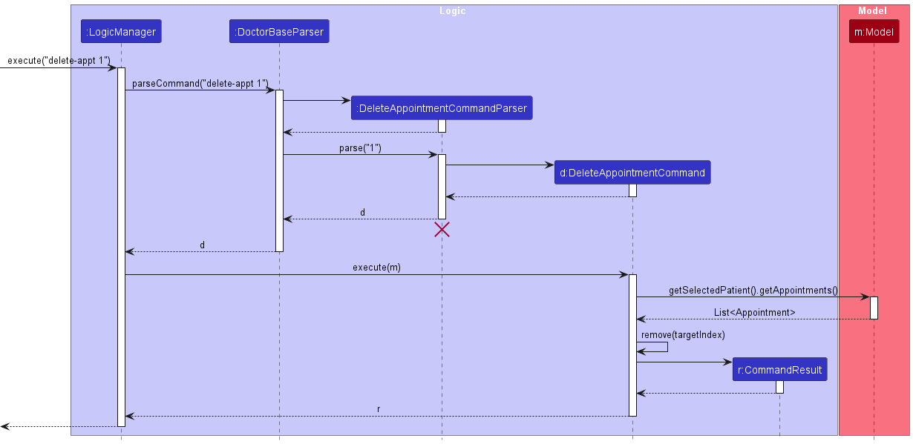

--------------------------------------------------------------------------------------------------------------------

## **Documentation, logging, testing, configuration, dev-ops**

* [Documentation guide](Documentation.md)
* [Testing guide](Testing.md)
* [Logging guide](Logging.md)
* [Configuration guide](Configuration.md)
* [DevOps guide](DevOps.md)

--------------------------------------------------------------------------------------------------------------------

## **Appendix: Requirements**

### Product scope

**Target user profile**: 
- Solo doctor who manages administrative tasks on their own.
- prefer desktop apps over other types 
- can type fast 
- prefers typing to mouse interactions 
- is reasonably comfortable using CLI apps

**Value proposition**: 
- Simplifies administrative workload
- Can manage patient records and appointments faster than a typical mouse/GUI driven app
- Reduces forgotten or missed appointments

### User stories

Priorities: High (must have) - `* * *`, Medium (nice to have) - `* *`, Low (unlikely to have) - `*`

| Priority | As a …​     | I want to …​                        | So that I can…​                                                         |
|----------|-------------|-------------------------------------|-------------------------------------------------------------------------|
| `* * *`  | new user    | see usage instructions              | refer to instructions when I forget how to use the app                  |
| `* * *`  | doctor      | add patient details                 | keep track of my patients                                               |
| `* * *`  | doctor      | delete patient details              | remove information on patients I no longer need                         |
| `* * *`  | doctor      | find a patient by name              | locate details of patients without having to go through the entire list |
| `* * *`  | doctor      | list patient details                | view all of my patients' information                                    |
| `* * *`  | doctor      | see my patients' appointments       | prepare for upcoming appointments                                       |
| `* * *`  | doctor      | add a patient's appointment         | register a new appointment                                              |
| `* * *`  | doctor      | delete a patient's appointment      | handle cancellation of appointments                                     |
| `* * *`  | doctor      | edit patients' contacts             | edit patients' information                                              |
| `* * *`  | doctor      | see all stored appointments         | easily see upcoming appointments                                        |
| `* * *`  | doctor      | edit upcoming appointments          | reschedule appointments if needed                                       |
| `* *`    | doctor      | search appointments by patient name | quickly locate a specific consultation                                  |
| `* *`    | doctor      | add detailed notes for each patient | remember diagnoses, observations and treatments                         |
| `*`      | doctor      | attach documents/links              | easily reference patient documents                                      |
| `*`      | busy doctor | autocomplete commands               | use the program more easily without technological know-how              |
| `*`      | busy doctor | use alias commands                  | quickly add patient and appointment information via shortcuts           |

### Use cases

(For all use cases below, the **System** is the `DoctorBase` and the **Actor** is the `user`, unless specified otherwise)

**Use case: UC1 - Add patient**

**MSS**

1. User chooses to add patient with relevant details 
2. DoctorBase adds patient into patient list  
   Use case ends.

**Extensions**

* 1a. DoctorBase detects an invalid parameter in the entered details
  * 1a1. DoctorBase rejects command and does not add patient into patient list  
    Use case ends.

* 1b. DoctorBase detects a duplicate patient entry
  * 1b1. DoctorBase rejects command and does not add patient into patient list  
    Use case ends.

 

**Use case: UC2 - List current patients**

**MSS**

1. User chooses to view a list of current patients 
2. DoctorBase shows list of patients to user  
   Use case ends.

**Extensions**

* 2a. DoctorBase detects no entries in list  
  Use case ends.

 

**Use case: UC3 - Delete patient**

**MSS**

1. User chooses to delete a patient from DoctorBase 
2. DoctorBase deletes the patient entry from storage  
   Use case ends.

**Extensions**

* 2a. DoctorBase does not find an entry of the selected patient
  * 2a1. DoctorBase rejects command and does nothing  
  Use case ends.

 

**Use case: UC4 - Add appointment**

**MSS**

1. User chooses to add an appointment to DoctorBase 
2. DoctorBase adds the appointment into appointment storage  
   Use case ends.

**Extensions**

* 1a. DoctorBase detects NRIC not in storage
  * 1a1. DoctorBase rejects command and does nothing  
  Use case ends.

* 1b. DoctorBase detects duplicate appointment 
	* 1b1. DoctorBase rejects command and does nothing  
           Use case ends.

* 1c. DoctorBase detects invalid parameter in appointment details
	* 1c1. DoctorBase rejects command and does nothing  
	Use case ends.

 

**Use case: UC5 - List appointment**

**MSS**

1. User chooses to view a list of existing appointments 
2. DoctorBase shows the list of existing appointments to User  
   Use case ends.

**Extensions**

* 2a. DoctorBase detects no entries in list  
  Use case ends.

 

**Use case: UC6 - Delete appointment**

**MSS**

1. User chooses to delete an appointment entry from the list of existing appointments 
2. DoctorBase deletes the appointment entry from the list of existing appointments  
   Use case ends.

**Extensions**

* 2a. DoctorBase does not find the indicated appointment entry
  * 2a1. DoctorBase rejects command and does nothing  
  Use case ends.

 

### Non-Functional Requirements

* The system should respond within 2 seconds (performance)
* The system should only be used by 1 user (scalability)
* The system should function on Windows 11, Linux, and MacOS (usability)
* The system should not store more than 500 patients 
* The system should not store more than 5000 appointments

### Glossary

* **Solo doctor**: A doctor that takes care of patients under them by themselves with no other assistance
* **Patient**: A person that receives care and has appointments with the solo doctor
* **Appointment**: A scheduled medical meeting between the patient and the solo doctor

--------------------------------------------------------------------------------------------------------------------

## **Appendix: Instructions for manual testing**

Given below are instructions to test the app manually.

:information_source: **Note:** These instructions only provide a starting point for testers to work on;
testers are expected to do more *exploratory* testing.

### Launch and shutdown

1. Initial launch

   1. Download the jar file and copy into an empty folder

   1. Double-click the jar file Expected: Shows the GUI with a set of sample contacts. The window size may not be optimum.

1. Saving window preferences

   1. Resize the window to an optimum size. Move the window to a different location. Close the window.

   1. Re-launch the app by double-clicking the jar file. 
       Expected: The most recent window size and location is retained.

1. _{ more test cases …​ }_

### Deleting a patient

1. Deleting a patient while all patients are being shown

   1. Prerequisites: List all patients using the `list` command. Multiple patients in the list.

   1. Test case: `delete 1`  
      Expected: First contact is deleted from the list. Details of the deleted contact shown in the status message. Timestamp in the status bar is updated.

   1. Test case: `delete 0`  
      Expected: No patient is deleted. Error details shown in the status message. Status bar remains the same.

   1. Other incorrect delete commands to try: `delete`, `delete x`, `...` (where x is larger than the list size)  
      Expected: Similar to previous.

1. _{ more test cases …​ }_

### Saving data

1. Dealing with missing/corrupted data files

   1. _{explain how to simulate a missing/corrupted file, and the expected behavior}_

1. _{ more test cases …​ }_
