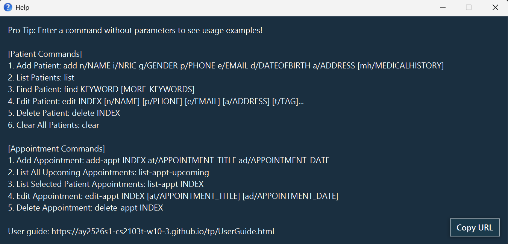

# DoctorBase

Hi there, and welcome to **DoctorBase**, your new desktop assistant for managing patient information and appointments!

DoctorBase is built with **keyboard-loving efficiency** in mind, but still gives you a visual interface so you're not stuck in a wall of text.

Whether you're a solo doctor managing many patients or just looking to streamline your workflow, DoctorBase is designed to help you stay on top of everything with less clicking and more doing.

# Table of Contents
1. [Quick start](#quick-start)
2. [Features](#features)
3. [FAQ](#faq)
4. [Known issues](#known-issues)
5. [Command summary](#command-summary)

--------------------------------------------------------------------------------------------------------------------

## Quick start

1. Check your java version
   * DoctorBase needs **Java 17** to run.
   * To check your Java version, in your computer's search bar, type `terminal` <br>
   * Then within the shell, type out this command and press enter: <br>
   ```
   java -version
   ```
   * If you do not have java 17 installed, please download it using these links
     * [**Windows**](https://se-education.org/guides/tutorials/javaInstallationWindows.html)
     * [**Mac OS**](https://se-education.org/guides/tutorials/javaInstallationMac.html)
     * [**Linux**](https://se-education.org/guides/tutorials/javaInstallationLinux.html)

2. Download DoctorBase 
   
* Download the latest `.jar` file (release) from [here](https://github.com/AY2526S1-CS2103T-W10-3/tp/releases).
   
3. Choose a Home Folder
   
* Move the .jar file to the folder where you’d like DoctorBase to save your data.
   
4. Open the terminal and navigate to that folder
   * Open Terminal (Mac/Linux) or Command Prompt (Windows)
   * Navigate to your folder using cd, like this:
     * macOS/Linux:
       ````
       cd ~/Documents/doctorbase
       ````
     * Windows (Command Prompt/Powershell):
       ```
       cd %USERPROFILE%\Documents\doctorbase
       ```
   Eg.
   ```
   cd home/documents/doctorbase
   ```
5. Run the app!
   * Once you're in the right folder, type this command and press Enter:
   ```
   java -jar DoctorBase.jar
   ```
   A GUI like the one shown below should appear within a few seconds. Note how the app contains some sample data.<br>
   

6. Try Your First Command!
  * Type the command in the command box and press `Enter` to execute it. e.g. typing **`help`** and pressing Enter will open the help window.<br>
    Some example commands you can try:

    * `list` : Lists details of all patients.

    * `list-appt 2` : Lists all appointments of patient at index 2

    * `list-appt-upcoming` : Lists all upcoming appointments

    * `add n/John Doe i/S8052802G g/m p/98765432 e/johnd@example.com d/12-12-2002 a/John street, block 123, #01-01` : Adds a contact named `John Doe` to the patient list.

    * `add-appt 2 at/flu jab ad/29-02-2025, 0900` : Adds an appointment called `flu jab` to the patient at `INDEX` 2

    * `edit 1 p/91234567 e/johndoe@example.com` Edits the phone number and email address of the 1st patient to be `91234567` and `johndoe@example.com` respectively.

    * `edit-appt 1 at/dental ad/02-02-2002, 0900` : Edits an appointment at `INDEX` 1 of the currently selected patient's appointment list to `dental`

    * `delete 3` : Deletes the 3rd contact shown in the current list.

    * `delete-appt 2` : Deletes the 2nd appointment of currently selected patient

    * `clear` : Deletes all patients.

    * `exit` : Exits the app.

7. Refer to the [Features](#features) below for details of each command.

--------------------------------------------------------------------------------------------------------------------

## Features

<div markdown="block" class="alert alert-info">

**:information_source: Notes about the command format:**<br>

* Words in `UPPER_CASE` are the parameters to be supplied by the user.<br>
  e.g. in `add n/NAME`, `NAME` is a parameter which can be used as `add n/John Doe`.

* Items in square brackets are optional.<br>
  e.g `n/NAME [mh/MEDICALHISTORY]` can be used as `n/John Doe mh/cancer` or as `n/John Doe`.

* Items with `…`​ after them can be used multiple times including zero times.<br>
  e.g. `[mh/MEDICALHISTORY]…​` can be used as ` ` (i.e. 0 times), `mh/cancer`, `mh/cancer mh/covid` etc.

* Parameters can be in any order.<br>
  e.g. if the command specifies `n/NAME p/PHONE_NUMBER`, `p/PHONE_NUMBER n/NAME` is also acceptable.

* Extraneous parameters for commands that do not take in parameters (such as `help`, `list`, `exit` and `clear`) will be ignored.<br>
  e.g. if the command specifies `help 123`, it will be interpreted as `help`.

* If you are using a PDF version of this document, be careful when copying and pasting commands that span multiple lines as space characters surrounding line-breaks may be omitted when copied over to the application.
</div>

### Viewing help : `help`

Shows a message explaining how to access the help page.



Format: `help`
<br>
<br>
<br>

### Adding a patient : `add`

Adds a patient to the patient list. <br>
Useful when you take a new patient under your care

Format: `add n/NAME i/NRIC g/GENDER p/PHONE_NUMBER e/EMAIL d/DATEOFBITH a/ADDRESS [mh/MEDICALHISTORY]…​`

* **Tip:** A patient can have any number of medicalHistories (including 0)

Examples:
* `add n/John Doe i/S8052802G g/m p/98765432 e/johnd@example.com d/12-12-2002 a/John street, block 123, #01-01`
* `add n/Betsy Crowe i/T0231512Z mh/covid e/betsycrowe@example.com a/Newgate Prison p/1234567 mh/leg fracture`
<br>
<br>
<br>

### Adding an appointment : `add-appt`

Adds an appointment to a patient's appointment list. <br>
Useful when you want to record a patient's upcoming appointment

Format: `add-appt INDEX at/APPOINTMENT TITLE ad/APPOINTMENT DATE`

* The `INDEX` refers to the index number shown in the displayed patient list. 
  * The index **must be a positive integer** 1, 2, 3, …​

Examples:
* `add-appt 2 at/flu jab ad/29-02-2025, 0900`
* `add-appt 1 at/full body checkup ad/18-12-2025, 1000`
<br>
<br>
<br>

### Listing all patients : `list`

Shows a list of all patients in the patient list. <br>
Useful when you want to view all the patients currently under your care

Format: `list`
<br>
<br>
<br>

### Listing all upcoming appointments : `list-appt-upcoming`

Shows a list of all upcoming appointments with any patient. <br>
Useful when you want to keep track of your upcoming appointment schedule

Format: `list-appt-upcoming`
<br>
<br>
<br>

### Listing all appointments of patient : `list-appt`

Shows a list of all appointments of the patient. <br>
Useful when you want to check the upcoming appointments of a patient

Format: `list-appt INDEX`

* Shows a list of all appointments a patient with the specified `INDEX`

Examples:
* `list-appt 1`
<br>
<br>
<br>

### Editing a patient : `edit`

Edits an existing patient in the patient list.

Format: `edit INDEX [n/NAME] [i/NRIC] [g/GENDER] [p/PHONE] [e/EMAIL] d/[DATEOFBIRTH] [a/ADDRESS] [mh/MEDICALHISTORY]…​`

* The `INDEX` refers to the index number shown in the displayed patient list.
  * The index **must be a positive integer** 1, 2, 3, …​
* At least one of the optional fields must be provided.
* Existing values will be updated to the input values.
* When editing medicalHistories, the existing medicalHistories of the patient will be removed i.e adding of medicalHistories is not cumulative.
* You can remove all the patient’s medicalHistories by typing `mh/` without
    specifying any medicalHistories after it.

Examples:
*  `edit 1 p/91234567 e/johndoe@example.com` Edits the phone number and email address of the 1st patient to be `91234567` and `johndoe@example.com` respectively.
*  `edit 2 n/Betsy Crower mh/` Edits the name of the 2nd patient to be `Betsy Crower` and clears all existing medicalHistories.
<br>
<br>
<br>

### Editing an appointment : `edit-appt`

Edits an existing appointment from the currently selected patient's appointment list

Format: `edit-appt INDEX [at/APPOINTMENT TITLE] [ad/APPOINTMENT DATE]`

* The `INDEX` refers to the index number shown in the displayed appointment list.
  * The index **must be a positive integer** 1, 2, 3, …​
* At least one of the optional fields must be provided.
* Existing values will be updated to the input values

Examples:
* `edit-appt 1 at/dental ad/02-02-2002, 0900`
* `edit-appt 2 ad/20-12-2025, 1200`
<br>
<br>
<br>

### Locating patients by name: `find`

Finds patients whose names contain any of the given keywords.

Format: `find KEYWORD [MORE_KEYWORDS]`

* The search is case-insensitive. e.g `hans` will match `Hans`
* The order of the keywords does not matter. e.g. `Hans Bo` will match `Bo Hans`
* Only the name is searched.
* Only full words will be matched e.g. `Han` will not match `Hans`
* Patients matching at least one keyword will be returned (i.e. `OR` search).
  e.g. `Hans Bo` will return `Hans Gruber`, `Bo Yang`

Examples:
* `find John` returns `john` and `John Doe`
* `find alex david` returns `Alex Yeoh`, `David Li`<br>
  
<br>
<br>
<br>

### Deleting a patient : `delete`

Deletes the specified patient from the patient list. <br>
Useful when a patient is no longer going to be under your care

Format: `delete INDEX`

* Deletes the patient at the specified `INDEX`.
  * The index refers to the index number shown in the displayed patient list.
  * The index **must be a positive integer** 1, 2, 3, …​

Examples:
* `list` followed by `delete 2` deletes the 2nd patient in the patient list.
* `find Betsy` followed by `delete 1` deletes the 1st patient in the results of the `find` command.
<br>
<br>
<br>

### Deleting an appointment : `delete-appt`

Deletes the specified appointment from the currently selected patient's appointment list. <br>
Useful when a patient cancels their appointment

Format: `delete-appt INDEX`

* The `INDEX` refers to the index number shown in the displayed appointment list.
  * The index **must be a positive integer** 1, 2, 3, …​

Examples:
* `list-appt 1` followed by `delete-appt 1` deletes the 1st appointment of the 1st patient in the patient list
* `find alex` followed by `list-appt 1` followed by `delete-appt 3` deletes the 1st appointment of the 1st patient in the results of the find command
<br>
<br>
<br>

### Clearing all entries : `clear`

Clears all entries from the patient list.

Format: `clear`
<br>
<br>
<br>

### Exiting the program : `exit`

Exits the program.

Format: `exit`
<br>
<br>
<br>

### Saving the data

DoctorBase data are saved in the hard disk automatically after any command that changes the data. There is no need to save manually.
<br>
<br>
<br>

### Editing the data file

DoctorBase data are saved automatically as a JSON file `[JAR file location]/data/doctorbase.json`. Advanced users are welcome to update data directly by editing that data file.

<div markdown="span" class="alert alert-warning">:exclamation: **Caution:**
If your changes to the data file makes its format invalid, DoctorBase will discard all data and start with an empty data file at the next run. Hence, it is recommended to take a backup of the file before editing it.<br>
Furthermore, certain edits can cause the DoctorBase to behave in unexpected ways (e.g., if a value entered is outside of the acceptable range). Therefore, edit the data file only if you are confident that you can update it correctly.
</div>
<br>
<br>
<br>

--------------------------------------------------------------------------------------------------------------------

## FAQ

**Q**: How do I transfer my data to another Computer?<br>
**A**: Install the app in the other computer and overwrite the empty data file it creates with the file that contains the data of your previous `DoctorBase` home folder.

**Q**: What happens if I accidentally type in the wrong parameters? <br>
**A**: Do not worry, the application will pick up invalid parameters and tell you what was the issue and will not update the patient/appointment list.

**Q**: Can I undo a mistaken deletion?
**A**: `DoctorBase` does not currently support an undo feature. Once a patient or appointment is deleted, it is permanently removed. We recommend making sure the correct patient or appointment is selected before running delete or delete-appt.

**Q**: Can I use `DoctorBase` without an internet connection?
**A**: Yes. `DoctorBase` works fully offline. Your data is stored locally on your computer and does not require internet access.

**Q**: Where is my data stored?
**A**: `DoctorBase` stores your data in a file named `DoctorBase.json` inside the `data` folder, located where the .jar file is run.

**Q**: Can I change where `DoctorBase` stores its data?<br>
**A**: Yes. Simply move your .jar file to a different folder and re-run it. `DoctorBase` will then create and store the data in a `data/` folder, relative to the new .jar location.

**Q**: Can I run `DoctorBase` on multiple computers?
**A**: Yes. Just copy your `DoctorBase.json` file to another machine running `DoctorBase`. As long as both computers have Java 17 or higher, your data will load normally.

**Q**: Can two patients share the same name?<br>
**A**: Yes, but their NRICs must be unique as `DoctorBase` uses their NRIC to differentiate between patients.

--------------------------------------------------------------------------------------------------------------------

## Troubleshooting

**Q**: The application does not start<br>
**A**: Please check your current version of java is 17, following the requirements specified by step 1 of [QuickStart](#quick-start) <br>
If that does not solve the issue, please redownload the latest `.jar` file (release) from [here](https://github.com/AY2526S1-CS2103T-W10-3/tp/releases) and try again.

--------------------------------------------------------------------------------------------------------------------

## Known issues

1. **When using multiple screens**, if you move the application to a secondary screen, and later switch to using only the primary screen, the GUI will open off-screen. The remedy is to delete the `preferences.json` file created by the application before running the application again.
2. **If you minimize the Help Window** and then run the `help` command (or use the `Help` menu, or the keyboard shortcut `F1`) again, the original Help Window will remain minimized, and no new Help Window will appear. The remedy is to manually restore the minimized Help Window.

--------------------------------------------------------------------------------------------------------------------

## Command summary

| Action                             | Format, Examples                                                                                                                                                                                                         |
|------------------------------------|--------------------------------------------------------------------------------------------------------------------------------------------------------------------------------------------------------------------------|
| **Add Patient**                    | `add n/NAME i/NRIC g/GENDER p/PHONE_NUMBER e/EMAIL d/DATEOFBITH a/ADDRESS [mh/MEDICALHISTORY]…​`<br> e.g., `add n/John Doe i/S8052802G g/m p/98765432 e/johnd@example.com d/12-12-2002 a/John street, block 123, #01-01` |
| **Add Appointment**                | `add-appt INDEX at/APPOINTMENT TITLE ad/APPOINTMENT DATE`<br> e.g., `add-appt 1 at/flu jab ad/29-02-2025, 0900`                                                                                                          |
| **Clear List**                     | `clear`                                                                                                                                                                                                                  |
| **Delete Patient**                 | `delete INDEX`<br> e.g., `delete 3`                                                                                                                                                                                      |
| **Delete Appointment**             | `delete-appt INDEX`<br> e.g., `delete-appt 1`                                                                                                                                                                            |
| **Edit Patient**                   | `edit INDEX [n/NAME] [p/PHONE_NUMBER] [e/EMAIL] [a/ADDRESS] [t/TAG]…​`<br> e.g.,`edit 2 n/James Lee e/jameslee@example.com`                                                                                              |
| **Edit Appointment**               | `edit-appt INDEX [at/APPOINTMENT TITLE] [ad/APPOINTMENT DATE]` <br> e.g., `edit-appt 1 at/dental ad/02-02-2002, 0900`                                                                                                    |
| **Find Patient**                   | `find KEYWORD [MORE_KEYWORDS]`<br> e.g., `find James Jake`                                                                                                                                                               |
| **List Patients**                  | `list`                                                                                                                                                                                                                   |
| **List Upcoming Appointments**     | `list-appt-upcoming`                                                                                                                                                                                                     |
| **List Appointments of a Patient** | `list-appt INDEX`<br> e.g., `list-appt 1`                                                                                                                                                                                |
| **Help**                           | `help`                                                                                                                                                                                                                   |
