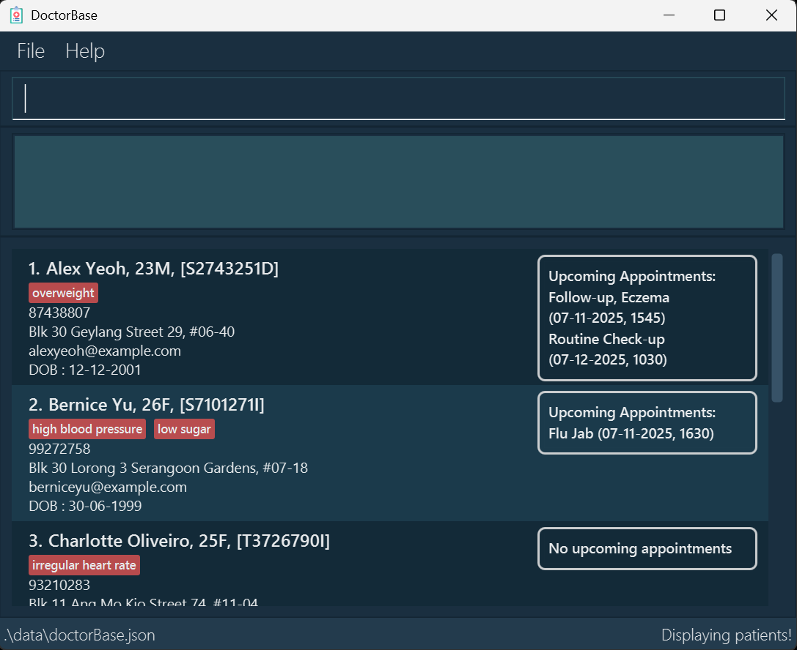
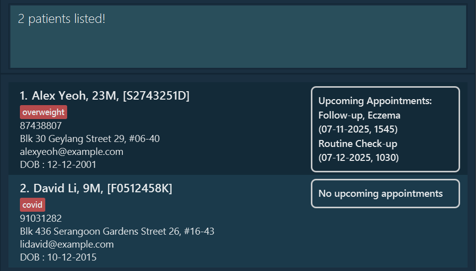

# DoctorBase

DoctorBase is a **desktop app for managing patient details and appointments, optimized for use via a keyboard input** which still having the benefits of a visual interface. <br>
This is the **perfect product** for solo doctors who take care of numerous patients with little assistance!

# Table of Contents
1. [Quick start](#quick-start)
2. [Features](#features)
3. [FAQ](#faq)
4. [Known issues](#known-issues)
5. [Command summary](#command-summary)

--------------------------------------------------------------------------------------------------------------------

## Quick start

1. Ensure you have Java `17` or above installed in your Computer.<br>
   * To check your Java version, in your computer's search bar, type `terminal` <br>
   * Then within the shell, type out this command and press enter: <br>
   ```
   java -version
   ```
   * If you do not have java 17 installed, please download it using these links
     * [**Windows**](https://se-education.org/guides/tutorials/javaInstallationWindows.html)
     * [**Mac OS**](https://se-education.org/guides/tutorials/javaInstallationMac.html)
     * [**Linux**](https://se-education.org/guides/tutorials/javaInstallationLinux.html)

2. Download the latest `.jar` file (release) from [here](https://github.com/AY2526S1-CS2103T-W10-3/tp/releases).

3. Copy the file to the folder you want to use as the _home folder_ for your DoctorBase.

4. To get started, open your computer’s command prompt (also called the terminal). Then, go to the folder where you saved the .jar file <br>
   * you can do this by typing `cd` followed by the `folder’s path`.
   * eg. file is located at home/documents/test
   ````
   cd home/documents/test
   ````
5. Once you're in the right folder, type this command and press Enter:
   ```
   java -jar DoctorBase.jar
   ```
   A GUI similar to the below should appear in a few seconds. Note how the app contains some sample data.<br>
   

6. Type the command in the command box and press Enter to execute it. e.g. typing **`help`** and pressing Enter will open the help window.<br>
   Some example commands you can try:

   * `list` : Lists all contacts.

   * `list-appt i/S8052802G` : Lists all appointments of patient with nric S8052802G

   * `add n/John Doe i/S8052802G g/m p/98765432 e/johnd@example.com d/12-12-2002 a/John street, block 123, #01-01` : Adds a contact named `John Doe` to the patient list.

   * `add-appt i/S8052802G at/flu jab ad/29-02-2025, 0900` : Adds an appointment called `flu jab` to the patient with nric S8052802G

   * `delete 3` : Deletes the 3rd contact shown in the current list.

   * `delete-appt i/S8052802G id/2` : Deletes the 2nd appointment of patient of nric S8052802G

   * `clear` : Deletes all contacts.

   * `exit` : Exits the app.

7. Refer to the [Features](#features) below for details of each command.

--------------------------------------------------------------------------------------------------------------------

## Features

<div markdown="block" class="alert alert-info">

**:information_source: Notes about the command format:**<br>

* Words in `UPPER_CASE` are the parameters to be supplied by the user.<br>
  e.g. in `add n/NAME`, `NAME` is a parameter which can be used as `add n/John Doe`.

* Items in square brackets are optional.<br>
  e.g `n/NAME [mh/MEDICALHISTORY]` can be used as `n/John Doe mh/cancer` or as `n/John Doe`.

* Items with `…`​ after them can be used multiple times including zero times.<br>
  e.g. `[mh/MEDICALHISTORY]…​` can be used as ` ` (i.e. 0 times), `mh/cancer`, `mh/cancer mh/covid` etc.

* Parameters can be in any order.<br>
  e.g. if the command specifies `n/NAME p/PHONE_NUMBER`, `p/PHONE_NUMBER n/NAME` is also acceptable.

* Extraneous parameters for commands that do not take in parameters (such as `help`, `list`, `exit` and `clear`) will be ignored.<br>
  e.g. if the command specifies `help 123`, it will be interpreted as `help`.

* If you are using a PDF version of this document, be careful when copying and pasting commands that span multiple lines as space characters surrounding line-breaks may be omitted when copied over to the application.
</div>

### Adding a patient : `add`

Adds a patient to the patient list. <br>
Useful when you take a new patient under your care

Format: `add n/NAME i/NRIC g/GENDER p/PHONE_NUMBER e/EMAIL d/DATEOFBITH a/ADDRESS [mh/MEDICALHISTORY]…​`

* **Tip:** A patient can have any number of medicalHistories (including 0)


Examples:
* `add n/John Doe i/S8052802G g/m p/98765432 e/johnd@example.com d/12-12-2002 a/John street, block 123, #01-01`
* `add n/Betsy Crowe i/T0231512Z mh/covid e/betsycrowe@example.com a/Newgate Prison p/1234567 mh/leg fracture`

### Adding an appointment : `add-appt`

Adds an appointment to a patient's appointment list. <br>
Useful when you want to record a patient's upcoming appointment

Format: `add-appt i/NRIC at/APPOINTMENT TITLE ad/APPOINTMENT DATE`

Examples:
* `add-appt i/S8052802G at/flu jab ad/29-02-2025, 0900`
* `add-appt i/T0321323S at/full body checkup ad/18-12-2025, 1000`

### Listing all patients : `list`

Shows a list of all patients in the patient list. <br>
Useful when you want to view all the patients currently under your care

Format: `list`

### Listing all appointments of patient : `list-appt`

Shows a list of all appointments a patient. <br>
Useful when you want to check the upcoming appointments of a patient

Format: `list-appt i/NRIC`

* Shows a list of all appointments a patient with the specified `NRIC`

Examples:
* `list-appt i/S8052802G`
* `list-appt i/T0231512Z`

### Editing a patient : `edit`

Edits an existing patient in the patient list.

Format: `edit INDEX [n/NAME] [i/NRIC] [g/GENDER] [p/PHONE] [e/EMAIL] d/[DATEOFBIRTH] [a/ADDRESS] [mh/MEDICALHISTORY]…​`

* Edits the patient at the specified `INDEX`. The index refers to the index number shown in the displayed patient list. The index **must be a positive integer** 1, 2, 3, …​
* At least one of the optional fields must be provided.
* Existing values will be updated to the input values.
* When editing medicalHistories, the existing medicalHistories of the patient will be removed i.e adding of medicalHistories is not cumulative.
* You can remove all the patient’s medicalHistories by typing `mh/` without
    specifying any medicalHistories after it.

Examples:
*  `edit 1 p/91234567 e/johndoe@example.com` Edits the phone number and email address of the 1st patient to be `91234567` and `johndoe@example.com` respectively.
*  `edit 2 n/Betsy Crower mh/` Edits the name of the 2nd patient to be `Betsy Crower` and clears all existing medicalHistories.

### Locating patients by name: `find`

Finds patients whose names contain any of the given keywords.

Format: `find KEYWORD [MORE_KEYWORDS]`

* The search is case-insensitive. e.g `hans` will match `Hans`
* The order of the keywords does not matter. e.g. `Hans Bo` will match `Bo Hans`
* Only the name is searched.
* Only full words will be matched e.g. `Han` will not match `Hans`
* Patients matching at least one keyword will be returned (i.e. `OR` search).
  e.g. `Hans Bo` will return `Hans Gruber`, `Bo Yang`

Examples:
* `find John` returns `john` and `John Doe`
* `find alex david` returns `Alex Yeoh`, `David Li`<br>
  

### Deleting a patient : `delete`

Deletes the specified patient from the patient list. <br>
Useful when a patient is no longer going to be under your care

Format: `delete INDEX`

* Deletes the patient at the specified `INDEX`.
* The index refers to the index number shown in the displayed patient list.
* The index **must be a positive integer** 1, 2, 3, …​

Examples:
* `list` followed by `delete 2` deletes the 2nd patient in the patient list.
* `find Betsy` followed by `delete 1` deletes the 1st patient in the results of the `find` command.

### Deleting an appointment : `delete-appt`

Deletes the specified appointment from specified patient's appointment list. <br>
Useful when a patient cancels their appointment

Format: `delete-appt i/NRIC id/INDEX`

* Deletes an appointment of patient with specified `NRIC`
* The index refers the index number shown in the patient's appointment list
* The index **must be a positive integer** 1, 2, 3, …​

Examples:
* `delete-appt i/S8052802G id/2`
* `delete-appt i/T0213123S, id/1`

### Clearing all entries : `clear`

Clears all entries from the patient list.

Format: `clear`

### Exiting the program : `exit`

Exits the program.

Format: `exit`

### Saving the data

DoctorBase data are saved in the hard disk automatically after any command that changes the data. There is no need to save manually.

### Editing the data file

DoctorBase data are saved automatically as a JSON file `[JAR file location]/data/doctorbase.json`. Advanced users are welcome to update data directly by editing that data file.

<div markdown="span" class="alert alert-warning">:exclamation: **Caution:**
If your changes to the data file makes its format invalid, DoctorBase will discard all data and start with an empty data file at the next run. Hence, it is recommended to take a backup of the file before editing it.<br>
Furthermore, certain edits can cause the DoctorBase to behave in unexpected ways (e.g., if a value entered is outside of the acceptable range). Therefore, edit the data file only if you are confident that you can update it correctly.
</div>


--------------------------------------------------------------------------------------------------------------------

## FAQ

**Q**: How do I transfer my data to another Computer?<br>
**A**: Install the app in the other computer and overwrite the empty data file it creates with the file that contains the data of your previous DoctorBase home folder.

--------------------------------------------------------------------------------------------------------------------

## Known issues

1. **When using multiple screens**, if you move the application to a secondary screen, and later switch to using only the primary screen, the GUI will open off-screen. The remedy is to delete the `preferences.json` file created by the application before running the application again.
2. **If you minimize the Help Window** and then run the `help` command (or use the `Help` menu, or the keyboard shortcut `F1`) again, the original Help Window will remain minimized, and no new Help Window will appear. The remedy is to manually restore the minimized Help Window.

--------------------------------------------------------------------------------------------------------------------

## Command summary

| Action                 | Format, Examples                                                                                                                                                                                                         |
|------------------------|--------------------------------------------------------------------------------------------------------------------------------------------------------------------------------------------------------------------------|
| **Add Patient**        | `add n/NAME i/NRIC g/GENDER p/PHONE_NUMBER e/EMAIL d/DATEOFBITH a/ADDRESS [mh/MEDICALHISTORY]…​`<br> e.g., `add n/John Doe i/S8052802G g/m p/98765432 e/johnd@example.com d/12-12-2002 a/John street, block 123, #01-01` |
| **Add Appointment**    | `add-appt i/NRIC at/APPOINTMENT TITLE ad/APPOINTMENT DATE`<br> e.g., `add-appt i/S8052802G at/flu jab ad/29-02-2025, 0900`                                                                                               |
| **Clear List**         | `clear`                                                                                                                                                                                                                  |
| **Delete Patient**     | `delete INDEX`<br> e.g., `delete 3`                                                                                                                                                                                      |
| **Delete Appointment** | `delete-appt i/NRIC id/INDEX`<br> e.g., `delete-appt i/S8052802G id/2`                                                                                                                                                   |
| **Edit Patient**       | `edit INDEX [n/NAME] [p/PHONE_NUMBER] [e/EMAIL] [a/ADDRESS] [t/TAG]…​`<br> e.g.,`edit 2 n/James Lee e/jameslee@example.com`                                                                                              |
| **Find Patient**       | `find KEYWORD [MORE_KEYWORDS]`<br> e.g., `find James Jake`                                                                                                                                                               |
| **List Patient**       | `list`                                                                                                                                                                                                                   |
| **List Appointment**   | `list-appt i/NRIC`<br> e.g., `list-appt i/S8052802G`                                                                                                                                                                     |
| **Help**               | `help`                                                                                                                                                                                                                   |
